# Collaboration in Git 
*** 
 
This chapter presents how to work with [Git](https://git-scm.com/), [GitKraken](https://www.gitkraken.com/), and [GitHub](https://github.com/).  
 
In general, Git is a version control system to track changes in text file (e.g., do-files, R scripts, csv, etc) and to share those changes with other people. Git is capable of letting you know whether a binary files (e.g., Word, Excel, PDF, DTA, etc.) has changed, but it won't tell how it changed. To get the most out of Git, programmers combine it with GitHub, which is a website that to share code with anybody (including people outside the World Bank), solicit improvements via pull requests, and track issues.  
 
## Initial Set up

Make sure you follow the steps below: 
 
1.	Open a GitHub account using your World Bank email account. [Here](https://github.com/join?source=header-home) or [here](https://github.com/). 

2.	Download [SmartGit](https://www.syntevo.com/smartgit/download/) and install it (see [below](#install-smartgit)). 

3.	[Install GIT](https://git-scm.com/downloads) (Optional). This step is optional because the two steps above suffice for working with Git. However, if you get into Git and want to do really advance stuff, you need to work with GIT directly.  
 
4.	Make sure R and RStudio are installed and updated in your computer. Even though we have not decided whether or not to work with R from now on, Rstudio is great IDE that allows us to do a lot of things including GIT management .
 
## Getting to know [Git](https://git-scm.com/) 
Git is a [Distributed Version Control System](https://git-scm.com/book/en/v2/Getting-Started-About-Version-Control). This means that Git is a system to fully clones the project and in its history into any client's repository or local computer.  Every time you save the state of your project (i.e., commit), Git basically takes a picture of what all your files look like at that moment and stores a reference to that snapshot. To be efficient, if files have not changed, Git doesn’t store the file again, just a link to the previous identical file it has already stored. Git thinks about its data more like a stream of snapshots of the whole project. This ability of taking snapshots of the projects is what makes Git to any other version control system. Other systems, like Microsoft Word or any other MS software, changes are tracked at the file level rather than at the project level. People is able to know how files have changes individually, but they don't know how those files change with respect to the changes applied to other files of the same project.  

## Basics of Git
 
### Working with repositories 
blah 


### Branching and Merging 
 
Branching and merging are the core of collaborating with multiple people. Branches are used to develop features isolated from each other. The master branch is the "default" branch when you create a repository. Use other branches for development and merge them back to the master branch upon completion. "Git branches are effectively a pointer to a snapshot of your changes. When you want to add a new feature or fix a bug—no matter how big or how small—you spawn a new branch to encapsulate your changes. This makes it harder for unstable code to get merged into the main code base, and it gives you the chance to clean up your future's history before merging it into the main branch."[^branching] 

## Getting to know [SmartGit](https://www.syntevo.com/smartgit/)

### Installation {.unnumbered #install-smartgit}

Download [SmartGit](https://www.syntevo.com/smartgit/download/) and install it. Download the files into the the folder that you'll use for installation and NOT into the "downloads" folder. If SmartGit automatically downloads the zip file into the "downloads" folder, then extract it into the folder you'll install it in. You don’t need admin permissions to install it, but download the _Portable Bundle_. The installation files can be found here: 'SmartGit > bin > smartgit.exe'.

Note: (1) During the installation process pick the "non-commercial use" option; (2) Integration with GitHub might be easier if you use the same username and email as that of your GitHub account.

### Integration with GitHub {-}

Once SmartGit is installed, do the following to integrate your GitHub account:

a. Go to 'Edit > Preferences > Hosting Providers'. Click the "Add..." button on the top-right of the window.

b. There are a few ways to integrate. The easiest is to pick the 'Use OAuth token for repository authentication (instead of password)' option. This should generate a token in your web browser. Use this token to complete the integration.

c. Once the GitHub account is added, your GitHub account should be listed in 'Hosting Providers' window in SmartGit. You can also check your GitHub account to make sure that SmartGit has been authorized. To see this, in your GitHub account, go to 'settings > applications'. You should see SmartGit listed under 'Authorized Apps'.

You can find the instructions on integration [here](http://www.syntevo.com/doc/display/SG/GitHub+integration).


### Organize your toolbar {-}
You can add convenient commands to your toolbar from the Edit> Customize > Toolbar menu.

```{r toolbar1, echo=FALSE, fig.align="center", fig.cap = "Toolbar"} 
knitr::include_graphics("images/Toolbar1.PNG") 
``` 
```{r toolbar2, echo=FALSE, fig.align="center", fig.cap = "Customize menu"} 
knitr::include_graphics("images/Toolbar2.PNG") 
``` 
```{r toolbar3, echo=FALSE, fig.align="center", fig.cap = "Add/delete commands"} 
knitr::include_graphics("images/Toolbar3.PNG") 
``` 

### Initialize Repos {-}


1. Go to **Repository** ➡ **Add or Create Repository**.

2. Select a folder that you created and saved in your computer (e.g., new_repo).


```{r fig1, echo=FALSE, fig.cap = "", out.width="55%"} 
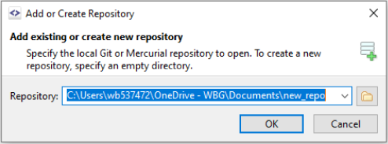 
```

3. Select Initialize. 


```{r fig2, echo=FALSE, fig.cap = "", out.width="55%"} 
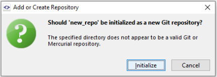 
```

### Clone Repos {-}

1. Go to **Repository** ➡  **Clone**.

2. Get and insert URL of Git repository you want to clone (e.g., https://github.com/PovcalNet-Team/Povcalnet_internal_guidelines.git). 


```{r fig3, echo=FALSE, fig.cap = "", out.width="80%"} 
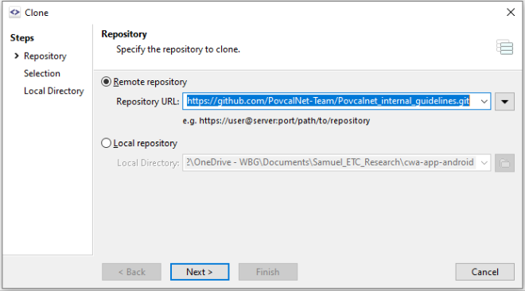 
```

You could also select from a list of repositories in your GitHub account. Use these steps:  

i. Click on the drop-down arrow and select github.com from the drop-down menu. 

```{r fig4, echo=FALSE, fig.cap = "", out.width="100%"} 
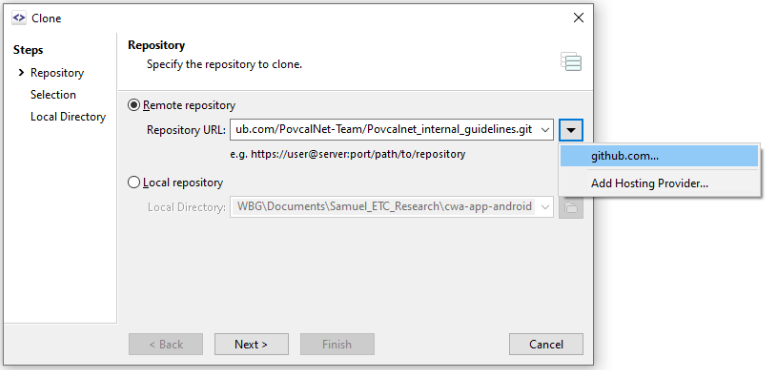 
```  

ii. Select the repository you want to clone from the list of repositories in your GitHub account.  

```{r fig5, echo=FALSE, fig.cap = "", out.width="80%"} 
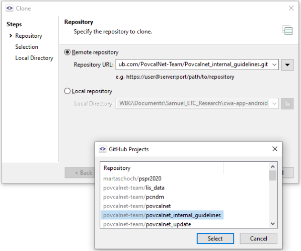 
```

3. Specify the local directory for the new repository.  

```{r fig6, echo=FALSE, fig.cap = "", out.width="80%"} 
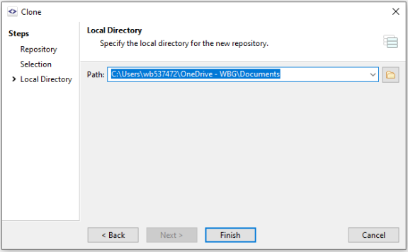 
``` 

### Organize Repos by groups {-}

1. Have some repositories that you can put into groups (e.g., GitHub, R, SmartGit, Stata).  

```{r fig7, echo=FALSE, fig.cap = "", out.width="100%"} 
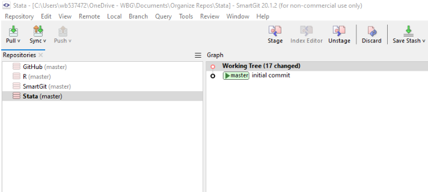 
```


2. Go to **Repository** ➡  **Add Group**  

3. Enter the group name (e.g., 'Version Control' for GitHub and SmartGit).  

```{r fig8, echo=FALSE, fig.cap = "", out.width="40%"} 
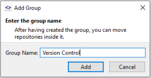 
``` 

3. Drag and drop repositories into the relevant group. 

```{r fig9, echo=FALSE, fig.cap = "", out.width="100%"} 
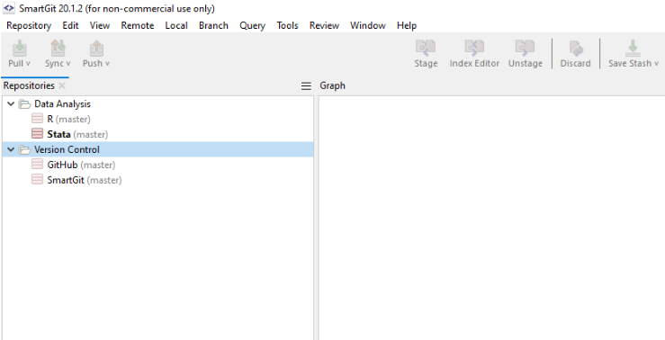 
```

### How do you link a repository that is your local machine to your GitHub account? {-}

1. Set up a new repository in GitHub.

```{r fig10, echo=FALSE, fig.cap = "", out.width="120%"} 
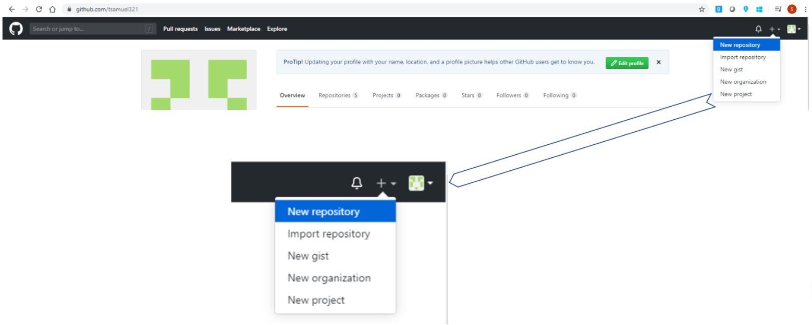 
```

2. Enter name of repository, select Public or Private, and do **NOT** select Initialize.

```{r fig11, echo=FALSE, fig.cap = "", out.width="100%"} 
knitr::include_graphics("images/do_not_select_initialize.PNG") 
```

NB: Steps (1) and (2) should be done in GitHub, and the next steps should be done in SmartGit.

3. Go to **Repository** ➡  **Add or Create**

4. Select a folder saved in your machine (e.g., dofiles_for_github). 

```{r fig12, echo=FALSE, fig.cap = "", out.width="55%"} 
knitr::include_graphics("images/dofiles_for_github.PNG") 
```

5. Select Initialize.

```{r fig13, echo=FALSE, fig.cap = "", out.width="55%"} 
knitr::include_graphics("images/initialize_v2.PNG") 
```

6. Go to **Local** ➡ **Stage**.

7. Select Stage.

```{r fig14, echo=FALSE, fig.cap = "", out.width="65%"} 
knitr::include_graphics("images/stage.PNG") 
```

8. Go to **Local** ➡ **Commit**.

```{r fig15, echo=FALSE, fig.cap = "", out.width="100%"} 
knitr::include_graphics("images/go_to_local_commit.PNG") 
```

9. Enter a commit message and hit Commit.

```{r fig16, echo=FALSE, fig.cap = "", out.width="80%"} 
knitr::include_graphics("images/enter_commit_message.PNG") 
```

10. Go to **Remote** ➡ **Add**.

11. Select the new GitHub repository that you created in Step 1.

```{r fig17, echo=FALSE, fig.cap = "", out.width="80%"} 
knitr::include_graphics("images/add_url.PNG") 
```

```{r fig18, echo=FALSE, fig.cap = "", out.width="55%"} 
knitr::include_graphics("images/github.PNG") 
```

12. Add the remote repository.

```{r fig19, echo=FALSE, fig.cap = "", out.width="60%"} 
knitr::include_graphics("images/add_remote_repo.PNG") 
```

13. Select master branch and origin.

```{r fig20, echo=FALSE, fig.cap = "", out.width="120%"} 
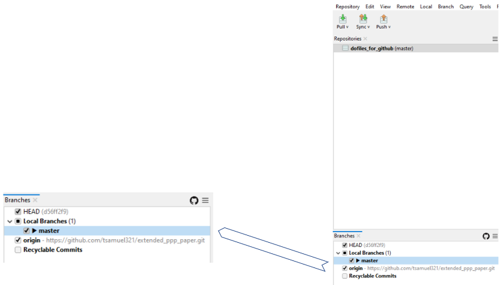 
```

14. Right-click repository you want to push to GitHub, and select **Push**.

```{r fig21, echo=FALSE, fig.cap = "", out.width="80%"} 
knitr::include_graphics("images/right_click_repo.PNG") 
```

15. Check if you have the repository on GitHub.

```{r fig22, echo=FALSE, fig.cap = "", out.width="100%"} 
knitr::include_graphics("images/check_github.PNG") 
```


### Basic Git process {-}

**- Stage**

Use to prepare a commit. This command saves your file's content from the working tree to the index. 

```{r sgstage, echo=FALSE, fig.cap = "Stage command"} 
knitr::include_graphics("images/SG_stage.PNG") 
``` 

**- Commit**

This command saves local changes to your local repository. Each commit is accompanied by a commit message. It is good practice to commit your changes often in order to save them in the repository. 
```{r sgcommit, echo=FALSE, fig.cap = "Commit command"} 
knitr::include_graphics("images/SG_commit.PNG") 
``` 

**- Push**

This command saves local commits to a remote repository hosted in the cloud, e.g. in Github. This is the key step for your work to be always backed-up in the cloud and accessible to other members in the team.
```{r sgpush, echo=FALSE, fig.cap = "Push command"} 
knitr::include_graphics("images/SG_push.PNG") 
``` 

**- How to stage commit and push**

First, let us take a look at the SmartGit interface.
```{r interface, echo=FALSE, fig.align="center", fig.cap = "SmartGit Interface"} 
knitr::include_graphics("images/interface.PNG") 
``` 

Now, let us see how to stage and commit a .do file.

```{r video0, echo=FALSE, fig.align="center", fig.cap = "Stage and commit a .do file"} 
knitr::include_url("https://www.youtube.com/embed/wDM5sQX5lEU") 
``` 

 We can also stage and commit binary files (e.g. MS office files). However, Git will not track changes. This video also shows how to push your files to the host. 

```{r video3, echo=FALSE, fig.align="center", fig.cap = "Stage, commit and push a file"} 
knitr::include_url("https://www.youtube.com/embed/dOUheWAKx_U") 
``` 

**- Pull**

This command fetches commits from a remote repository and includes them into your local branch. You can pull from the remote repository clicking on the pull icon and selecting Pull in the window that appears on your screen:

```{r pull1, echo=FALSE, fig.cap = "Pull icon"} 
knitr::include_graphics("images/pull1.PNG") 
``` 
```{r pull2, echo=FALSE, fig.align="center", fig.cap = "Pull or fetch only"} 
knitr::include_graphics("images/pull2.PNG") 
```

Once you click on pull you should see a confirmation of a successful pull (unless there is a conflict, more on this later on).

```{r pull3, echo=FALSE, fig.align="center", fig.cap = "Successful (rebase) pull"} 
knitr::include_graphics("images/pull3.PNG") 
``` 

**- Create a new branch**

Branching is a crucial step in collaborating with others in Git. You start a new branch to store your work independently from the master tree. Remember that in Smartgit you need to double click on your local branch to check-out: this simply means that you are making the selected branch your local one. 
You can see the steps to create and check-out your new branch below.
We start from the simplest example. We cloned a repository with only the master branch (see in the Branches window):

```{r branch1, echo=FALSE, fig.align="center", fig.cap = "Master Branch"} 
knitr::include_graphics("images/branch1.PNG") 
``` 

We now click on the icon:

```{r sgbranchi, echo=FALSE, fig.cap = "New Branch command"} 
knitr::include_graphics("images/SG_branch.PNG") 
``` 

SmartGit will ask you to give a name to your branch, in this case "MartaS" (Notice that it can actually be more efficient to name your branch after the task you are performing, e.g. adding section 3, rather than the name of the author as the same author might be working on more than a task) and click on "Add branch":

```{r branch2, echo=FALSE, fig.align="center", fig.cap = "Add new branch"} 
knitr::include_graphics("images/branch2.PNG")
``` 

Remember we want to make sure that we are working on the "MartaS" branch (Working on the master branch might cause a lot of disruption especially if many people are starting their own branches from the master. Be careful!). Double click on the "MartaS" branch in the Branches window and this message will appear:

```{r branch3, echo=FALSE, fig.align="center", fig.cap = "Checkout a Branch"} 
knitr::include_graphics("images/branch3.PNG") 
``` 

After you click on checkout the "MartaS" branch will change to bold characters in the Branches window. You are all set and can start working on your task!

```{r branch4, echo=FALSE, fig.align="center", fig.cap = "Local Branch changed from master to MartaS"} 
knitr::include_graphics("images/branch4.PNG") 
``` 

All commits will be now saved to the branch "MartaS" and can be incorporated in the master branch after the person in charge of the repository resolves possible conflicts and decides to merge. More on this below.

### Important keyboard shortcut process {-}

### Nice features of SmartGit {-}

### Advance Git process {-}

- Creating pull request from SmartGit
- stashing
- discarding
- revert commits
- History of files
- Solve merge conflicts
- Ammend a commit
- Other things

## Getting to know [GitKraken](https://www.gitkraken.com/) 
Even though Git was originally thought to be executed at the command line, there are several GUIs that ease your interaction with Git and get you excited about it. Yet, keep in mind that "most of the GUIs implement only a partial subset of Git functionality for simplicity. If you know how to run the command-line version, you can probably also figure out how to run the GUI version, while the opposite is not necessarily true. Also, while your choice of graphical client is a matter of personal taste, all users will have the command-line tools installed and available."[^1]  
 
Among the GUIs available, we thinkg GitKraken is the best one to get you started. However, if you're interested on learning Git at the command line, we recommend the book *Pro Git* by Scott Chacon and Ben Straub, which is available [online for free](https://git-scm.com/book/en/v2).  
 
The best place to learn everything about GitKraken is the [GitKraken Support](https://support.gitkraken.com/) webpage. However, bellow you will find the most basic things that you need to know about it and, when considered necessary, you will find either reference links for more detailed information or embedded videos. For instance, the video bellow shows the basics of GitKraken. 
 
```{r video1, echo=FALSE, fig.align="center", fig.cap = "Introduction to GitKraken"} 
knitr::include_url("https://www.youtube.com/embed/ub9GfRziCtU") 
``` 
 
### GItKraken Interface {-} 
 
```{r GKinterface, echo=FALSE, fig.cap = "GitKraken Interface"} 
knitr::include_graphics("images/gitKraken_ide.png") 
``` 
 
Figure \@ref(fig:GKinterface) presents the GItKraken interface, which has four main components.  
 
1. The **Toolbar** shows the most common actions in repositories. In our case, we will focus on *pull*, *push*, and *branch*.  
 
2. The **Left reference panel** shows properties of your repository. In this panel you can see what branches are stored in your local computer and which in the cloud (i.e., remote repository). You may use it also to know whether you're ahead or behind any specific branch.  
 
3. The **Commit panel** at your right is where files and changes from your working directory are being watched (i.e., tracked). In this panel you may can see whether a particular file has been modified (orange), deleted (red), created (green) or renamed (blue) with respect to the previous commit. Also, you can see the state of your files with in your current commit. That is, you may know whether each file is staged or untagged.  
 
```{r GKcolors, echo=FALSE, fig.cap = "color guide for file symbols"} 
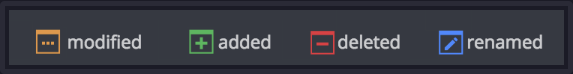 
``` 
 
4. The **commit graph** is the core of your repository's development and a representation of the [Directed Acyclic Graph](https://en.wikipedia.org/wiki/Directed_acyclic_graph). As explained in the GitKraken documentation, *"[e]ach row of the graph represents one commit, and the top is always for the latest changes. An interactive //WIP (Work-In-Progress) node will show if the working directory has changed since the last commit. Branches and tag labels on the left side of the graph are pointers to specific commits, and each vertical column represents a branch currently available on the repository. Columns can intersect through merge commits as shown in the graph legend. As also shown, multiple branches can be at the same place of a single commit and can be both local and remote."* 
 
```{r GKnodes, echo=FALSE, fig.cap = "Nodes meaning"} 
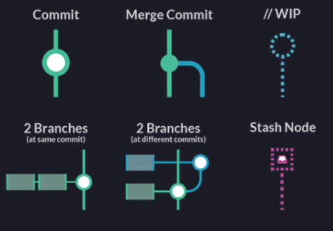 
``` 
 
### Create a repository {-} 
 
In Git, a repository refers to a folder with all the files and sub-folders of a project. In other words, it refers to the folder of a project. It is possible to create a git repository in an existing project folder, but it is recommended to initialize a Git repository before you start working on your project.  
 
1. Open GitKraken and click on the folder icon at the upper-left side of the screen and then click `Init`. Alternatively, you could go to `file -> Init repo`, or use the shortcut `Ctrl + I`. 
 
2. Given that we are going to be working with GitHub, click on the icon `GitHub.com`. 
 
3. Select your account in case you have more than one GitHub account.  
 
4. Provide a name for your repository. The name cannot have spaces.  
 
5. If you want, add a description of the project.  
 
6. Select Public or Private repository. Keep in mind that if you have a free GitHub account: 
  * You can have unlimited public repositories with unlimited collaborators.  
  * You can have unlimited *private* repositories with no more than **three collaborators**. This is very inconvinient for large teams like PovcalNet.  
 
7. Check the box `Clone after init` 
 
8. Select the folder in your computer where you want to clone the repository. Make you do NOT create a folder for the repository because Git will created for you using the name provided in step 2.2. You only need provide the root folder.  
 
9. Do not do anything on the field `Full Path`. It is just for your information.  
 
10. Do not select anything on `.gitignore` yet. We will cover that below. 
 
11. If you are creating a package or a document that must be cited if used, select `MIT license` 
 
12. leave unchecked the box `initialize with LFS` 
Your screen should look something like this: 
```{r initrepo, echo=FALSE, fig.cap = "Initialize repo"} 
  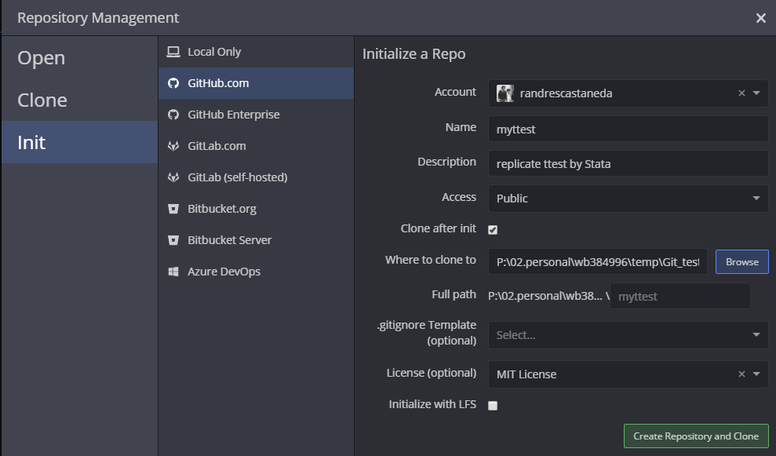 
``` 
 
13. Once you have create your repository, make sure to open it and initialize it. 


### Clone a repository {-} 
 
If you want to contribute in an existing repository, you can do it as an existing collaborator or as an external user. If you're an existing collaborator, you can create branches, commit and push your work into the main repository. If the repository is hosted in a free Github account, you are even able to merge your branch into the master branch. However, if the repository is paid (PRO) license in GitHub, the owner of the account may set restrictions to collaborators and branches. In the second case, if you are an external user of the repository, you can't push your work into the original repository but you can fork it (which is making a copy of the repository into your account), modify it as you consider necessary and make a [pull request](https://support.gitkraken.com/working-with-repositories/pull-requests/).  
 
In order to contribute into any of the PovcalNet repositories you must be an existing collaborator. Thus, in this section you will learn how to clone a repository.  
 
1. Go the to the repository you want clone in GitHub.  
2. Clik on the green button "Clone or download" and copy the whole url.  
 
```{r GHclone, echo=FALSE, fig.cap = "GitHub link to clone repo"} 
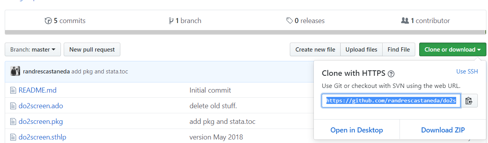 
``` 
 
3. Go to GitKraken and click on the folder icon at the upper-left side of the screen and then click `clone`. Alternatively, you coul go to `file -> Clone repo`, or use the shortcut `Ctrl + N`. 
 
4. Select the Github.com icon 
 
5. Select the folder where the repository is going to be cloned 
 
6. Select the repository from the menu.  
 
```{r GKclone, echo=FALSE, fig.cap = "Clone repo in GitKraken"} 
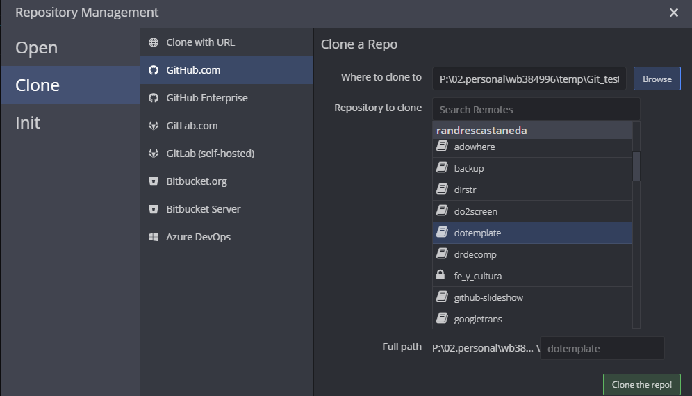 
``` 
 


### Working with commits {-}
 
A commit is a snapshot of your project but, as you work on it, you're able to decide how the snapshot would look like. You can select what parts or files of your progress will be committed (or snapshotted) and even select what file are not going to be tracked in your progress. All of this is done as follows: 
 
1. Once your files have been modified (Fig. \@ref(fig:GKnodes)) and saved, GitKraken identifies them as work in progress (//WIP) and shows you the details in the **Unstaged file** box.   
 
```{r GKwip, echo=FALSE, fig.cap = "GitKraken Work In Progress"} 
  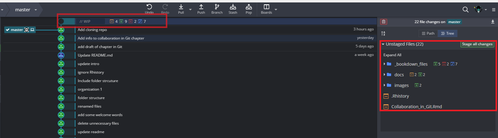 
``` 
 
2. By clinking in the name of any file in the commit panel (Fig. \ref(fig:GKinterface)), the commit graph will be replace by the [*GitKraken diffs*](https://support.gitkraken.com/working-with-commits/diff/) interface which shows what was added or removed from a file. Red is for lines where content was removed whereas green is for new lines added. 
 
3. You can select [1] all the files, [2] some of the files, or [3] even some hunks within each file to be *stage*. Your select will compose the next commit. If you decide you don't want make a staged file part of your next commit, you can unstage it.  
 
4. Record your commit message for the staged files to the repository. In **Summary** you include a brief but meaningful message supporting your commit. This text will appear in the graph and is mandatory. In **Description** you may add extended message to provide more details behind the changes. 
 
5. Click **Commit changes** 
 
6. You may repeat this process as many times you want. When you're ready, you may push your work to the remote repository into your own branch.  


[^1]: Scott Chacon and Ben Straub, Pro Git, 2nd ed. edition (New York, NY: Apress, 2014). [sect. 1.4](https://git-scm.com/book/en/v2/Getting-Started-The-Command-Line) 
 
[^branching]: Atlassian, "Git Branch | Atlassian Git Tutorial" Atlassian, accessed June 3, 2019, [link](https://www.atlassian.com/git/tutorials/using-branches). 
