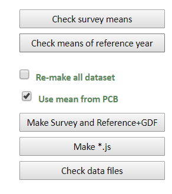

# Upload Group Data to the Data Management System {#DMGroupData}

-   Server: <http://wbgmsrech001/povcalnet/DB_Management.aspx>

-   Given that anyone may have access to the Data Base Management System, the
    username and password are not provided in this document.

## Group Data

### Preparing the data

Once the Group Data is received from the regional focal point of the Poverty GP,
It has to be copied and pasted into a text file. Two columns of data must be
pasted into the text file; one for weight and one for welfare, which may come in
three different varieties and are clearly explain the [Povcalnet
Website](http://iresearch.worldbank.org/PovcalNet/povcalculator.aspx). For the
case of China 2016, which is the database used as example in this text, data
comes in type 5 format,[^dm_group_data-1] which means that the weight variable
is the share of the population in a given quantile and the welfare variable is
the mean of welfare therein. If the data comes broken down by urban and rural
population, it is necessary to create one text file for each distribution.

[^dm_group_data-1]: Even though there are only three types of grouped data, they
    are labeled type 1, type 2, and type5

### Naming convention

Text files must be saved with the following naming convention,

> `CCCgXX.T0F,`

where the only literal piece of the naming convention is `T0`. All the other are
as follows:

-   `CCC` refers to the country code. However, the name of the country has been
    used in the past.
-   `g` refers to the geographic area: `r` for rural, `u` for urban, and `n` for
    national
-   `XX` stands for the last two digits of the corresponding year of the survey.
    For example, if the year is 2016, then `XX` would be 16.
-   `F` refers to the type formatting of the data. In the case of China 2016 it
    would be 5.

Make sure the text does not have the extension `txt`. In software used to save
the text file includes the extension `txt` by default, make sure to remove it
manually.

So, the final name for rural China 2016 would be `CHNr16.T05`

### Upload the data.

After logging into the server, the new group data must be uploaded by clicking
on `choose Files`, next to the *Data file(s)* legend, and choosing the
corresponding file from the files explorer. Finally, you have to click on
`Upload data file(s)` at the very right of the page. This process has to be done
file by file. Apparently, before the last update of the system, it was possible
to upload several files at the same time.

```{r DM-upload-files, echo=FALSE, fig.cap = "Upload files", fig.show = "hold", fig.align = "center"}
knitr::include_graphics("images/DM_upload_files.png")
```

## Making sure everything works

Once the new data and the updated metadata are uploaded, you may proceed to
click one by one of the buttons shown in Figure \@ref(fig:DM-check). Make sure,

1.  The box `Re-make all dataset` remain should be checked.
2.  Do **NOT** click on `Clean up data files.` (Not shown in Figure
    \@ref(fig:DM-check))

```{r DM-check, echo=FALSE, fig.cap = "Upload files", fig.show = "hold", out.width = "50%", fig.align = "center"}

```

Finally, click on `Rebuild listed Economy docs` (which needs to be done only
once, in case of uploading several times the master file) and then click on
`Restart PovcalNet`.
