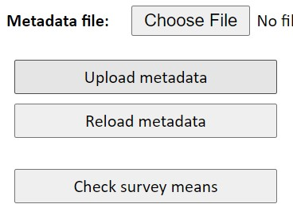
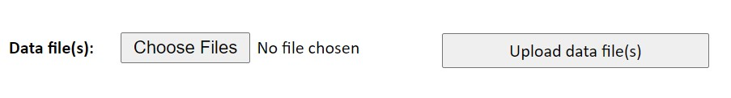
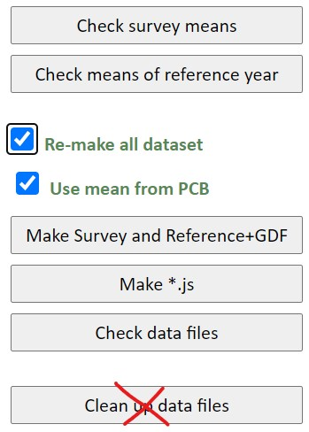

# The Data Management System {#DMSystem}

The Data Management (DM) system is managed directly within your Internet
Browser. Since it is available to anyone in the World Bank, you need to request
to the TTLs of the PovcalNet team the correct url. For now, it is worth
mentioning that there are *four* different servers in the PovcalNet system.

### Development (internal) server {.unnumbered}

The Development (or Internal) server is mainly for quality assurance (QA) work.
The whole PovcalNet update is done in this server. Everything that is explained
in this chapter is supposed to be done in this server. Once it is done, ITS will
make a perfect copy into production.

### Production {.unnumbered}

The production server is the final step in the deployment process. In reality,
the production server is two servers that run in the back-en of the PovcalNet
website, balancing out the load of users requests at all time. This server is
not managed by any member of the PovcalNet team, but only by ITS. When the
update is complete in the Development server, ITS makes a perfect copy from
development to production, deploying thus a new version of the whole PovcalNet
system.

### Testing server {.unnumbered}

This server is mainly used for experimentation. The kind of work done in this
server may highly affect the overall structure of the PovcalNet system, and
therefore it cannot be done in either development of production. For instance,
in 2020 the PovcalNet team and the Poverty GP wanted to assess the possibility
of removing the consumption data of Mexico, leaving only the income data into de
system. To avoid problems on development or production, this assessment was done
in the testing server, where the data could be removed safely and a special
version of the master file could be uploaded.

### Restricted (AR) server {.unnumbered}

This server is used when restricted data are intended to be part of the
PovcalNet system. In theory, anyone in the WB may access the data in the
testing, development, or production servers. The restricted server just adds an
extra layer of authentication in which only selected people can access the data.
It is seldom used.

## Master Data

When the master file is updated locally, the most recent version will be always
available in the folder `p:\01.PovcalNet\00.Master\02.vintage\`. There you can
find all the different versions of the master file since September, 27th, 2018.
The suffix number of each file indicates the date and time in which the file was
created. It has the form **YYYYMMDDhhmmss**, for year, month, day, hour, minute,
and second. [Always make sure you upload the most recent version]{.red}.

To select the Master file in the DM system, click "Choose file" next to the
label **Metadata file**, and then click on "Upload metadata", otherwise it won't
be uploaded. Finally, you can click on "Check Survey means" to see the if the DM
system loaded correctly the Master file.

## PCB files

Once you have created the pcb files following the instructions in chapter
\@ref(create-pcb-files), you can upload them into the DM system either one by
one or in batch mode. Batch mode is restricted to one person only, which is
[Tony Fujs](mailto:tfujs@worldbank.org) as of today (2020-12-18). If you need to
upload more than, say, five .pcb files, we recommend you let Tony know where the
files are and ask him to upload them to the development server. If the number of
.pcb files to upload is small, you can upload them one-by-one. The reason why
you can't upload many files at the same time is that the server has a very
limited size capacity for uploading files. If the overall upload is larger than
4MB, the process will fail.

To upload a .pcb or group data file manually, you need to click on "choose
Files" next to the label **Data files(s) (**[make sure you don't confuse it with
the one next to **Metadata**]{.red}**)**. Then, you need to click on "Upload
data file(s)."

## Updating the system

Once the master file and the new .pcb and group data files have been uploaded
into the system, you need to make sure everything is updated properly. The
easiest and safest way to do that is by clicking one-by-one of the buttons below
with the exception of "Clean up data files." Also, make sure sure to check the
two boxes in the middle. Clicking all these buttons may take several minutes of
your time, you we recommend that for small updates you only click on "Check
survey means" and "Make Survey and Reference+GDF", and leave the box "Re-make
all dataset" **unchecked**. In most of the cases, this is enough to update the
whole system, but if something is failing, it is better to execute all the steps
as explained above.

Finally, once it is ready to be deployed in Production, click on "Rebuild listed
Economy docs" (which needs to be done only once, in case of uploading several
times the master file) and then click on "Restart PovcalNet".
