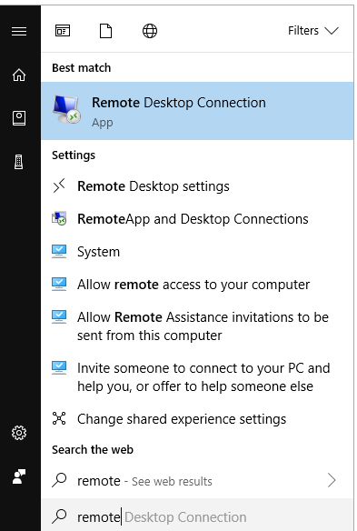
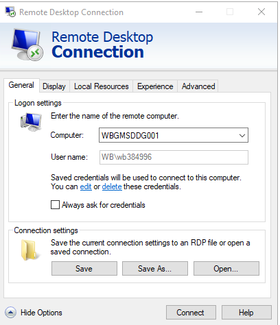
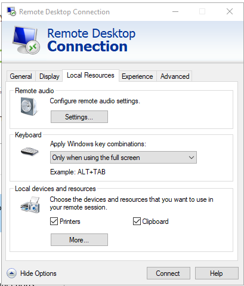
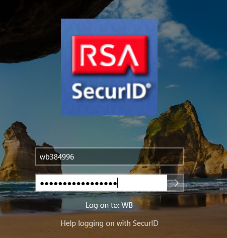

# Folder Strcutures

This short note provides everything you need to understand the folder structure of the PovcalNet workflow, which has the following objectives in mind:

1. Store vintages of data for replicability purposes
2. Share documents (i.e, editable files) among the team members through a stable, friendly, and vintage-control suitable platform.
3. Execute, load, and save data uninterruptedly and, if possible, in a fast manner.

Unfortunately, the World Bank systems do not provide an ITS service that allows us to meet all the objectives, and thus we are forced to use different platforms. A Network drive for the first objective, OneDrive for the second one, and a server (super computer) of remote execution for the third one. 

## Network Drive

The Network drive is mainly used to archive data. Currently, it is known as the *P drive*, but it could be disconnected and remapped by following the steps [below](#steps). 

This drive has many folders in its root, but under the new folder structure only three folders would take predominance, `01.Povcalnet`, `02.personal`, and `03.ProjectX`. The latter is not explained in this document 

* `01.povcalnet`has four main subfulders and follow the structure below:

```{r tree2, echo = FALSE}
a <- c(
dir("P:/01.PovcalNet/", full.names = TRUE),
dir("P:/01.PovcalNet/00.Master", full.names = TRUE),
dir("P:/01.PovcalNet/01.Vintage_control", full.names = TRUE),
dir("P:/01.PovcalNet/01.Vintage_control/AGO", full.names = TRUE),
dir("P:/01.PovcalNet/01.Vintage_control/_aux", full.names = TRUE),
dir("P:/01.PovcalNet/02.Production", full.names = TRUE),
dir("P:/01.PovcalNet/03.QA", full.names = TRUE)
)

tb <- tibble(pathString = a)
tb <- tb %>%  
separate(col = pathString, 
         into = letters,
         sep = "/",
         extra = "drop", 
         fill = "right",
         remove = FALSE
         ) %>% 
filter(!(c == "01.Vintage_control" 
   & (is.na(e))
   )
 ) %>% 
arrange(b, c, d, e)

as.Node(tb)
```

* `/00.Master` contains everything related to the master.xlsx file that is uploaded into the PovcalNet system. This file has its own way for proper use and requires a separate explanation.
* `/01.Vintage_control` contains the historical data of PovcalNet. Eventually, this would be folder accessible through `datalibweb`.
* `/02.Production` is the folder with the current version of the data in the PovcalNet system.
* `/03.QA` is a working folder that is getting constantly modified. Each subfolder here contains the necessary material to work on particular stages of the PovcalNet process
  
* `02.personal` contains one folder for each member of the team. The name of the folder is the UPI of the user preceded by the the letters `wb`. 
```{r tree3, echo = FALSE}
a <- dir("P:/02.personal/", full.names = TRUE)
b <- dir("P:/02.personal/_handover", full.names = TRUE)

tb <- tibble(pathString = c(a, b))
as.Node(tb)
```


### Steps to map drives {#steps}

In these steps, we disconnect any mapped drive that has previously assigned to letters P or E. Then, we assign to letter P  the network drive and to letter E the high-speed drive in the [server](#server). 

1.	Open Notepad. 
2.	Copy and paste the following lines:
```
net use /del P: /Y
net use /del E: /Y

net use P: \\wbntpcifs\povcalnet /PERSISTENT:YES
net use E: \\wbgmsddg001\PovcalNet /PERSISTENT:YES
```
3.	Save it in your desktop as `link_drives.bat`
4.	Close Notepad
5.	Double click file `link_drives.bat` in your desktop. 

## Remote server connection {#server}

The server is a 'super computer' with 8 processor and 64GB of RAM memory. All the 

### Steps to connect to the server {#connect}
In order to get access to the remote server, please do the following: 

1. Click on Start, type 'remote', and click on "Remote Desktop Connection"



2. Type `WBGMSDDG001` in the field 'Computer:' and click on 'show options'
3. Make sure the box 'Always ask for credentials' is **unchecked**



4. Click tab 'Local Resources' and make sure boxes 'Printers' and 'Clipboard' are checked. Then click 'More...'



5. Make sure that only boxes '(C:)OSDisk' and 'Drives that I plug in later' are **checked** and then click OK.
6. click connect. 
7. Enter your username (i.e., wbXXXXXX) and Windows passphrase, where XXXXXX is your UPI number.
8. Once your in the server, enter again your username and Windows passphrase.



You need to execute steps 2 to 7 only once. Next time you login into the server you only need to execute steps 1 and 8. 


### Map Network drive in the server

Once you're in the server, open Window Explorer and go to the path `E:\PovcalNet\02.core_team\_aux\` in which you will see a file called `link_P_Drive.bat`. Double click that file in order to map the PovcalNet network drive in the server. This procedure has to be done only once. After that, the network drive will be always mapped in the server for you. 

### Folder strcuture in the server. 

If you already mapped P drive to the server, you will see that you have access to three drives: the `C:/` drive, which is the main drive of the server, the `P:/` drive, which is our team network drive, and the `E:/` drive. 

You are **not** supposed to use the `C:/` for anything. Some programs like R of Python save their packages or libraries in the `C:/`, which is fine. But the `C:/` drive is not for storing data, MS files, or anything personal. If you need to save something on the `C:/` drive, please let leads of the povcalnet team know. 

The `P:/` is fully accessible through the server, so any code pointing to the `P:/` drive in your computer will work effortlessly in the server. 

The `P:/` drive is a high speed drive to store big data or large ammount of files to execute fast. This is **NOT** and storage drive, since its capacity is limited. All your data should be stored in the `P:/` and copied to the `E:/` drive temporally for fast execution. Once you're done with your analysis, you can copy back any results to the `P:/` drive and empty the `E:/` to allow others to use it. Ideally, we would increase the size of the `E:/` drive but that is not a possibility now. 

```{r tree4, echo = FALSE}
a <- c(
  dir("E:/", full.names = TRUE),
  dir("E:/01.personal", full.names = TRUE),
  dir("E:/02.core_team", full.names = TRUE),
  dir("E:/03.pcn_update", full.names = TRUE)
)

tb <- tibble(pathString = a)

as.Node(tb)
```

In the subfolder `E:/01.personal` you may place all the date files you need for highspeed performance. For some particular projects, you will be asked to place the folders in the folder `E:/02.core_team`. 


## OneDrive

OneDrive has a double storage functionality. On the one hand, each person has been granted with 5TB of memory in a [personal folder](https://worldbankgroup-my.sharepoint.com/) that is accessible through either the web browser or through the Window Explorer. 

On the other hand, OneDrive offers shared libraries for collaboration among the members of a [private team](https://teams.microsoft.com/_#/?lm=deeplink&lmsrc=officeWaffle). The PovcalNet team currently has assigned the library called [PovcalNet Data, Systems and Management](https://worldbankgroup.sharepoint.com/teams/PovcalNetDataSystemsandManagement-WBGroup) and it is accessible either through the [web browser](https://teams.microsoft.com/_#) or through the Microsoft Teams app. In general, the shared library in OneDrive works in the same way as the personal OneDrive folder with the exception that *MS Teams* automatically creates a folder in the root of the library for each new channel that is added to team. Besides this inconvenience, the suggested folder structure is as follows

```{r load, echo = FALSE, results='hide', message = FALSE}

# intitial conditions
drive <- "//wbntpcifs/PovcalNet/TestFolder"

current <- tibble(path = list.dirs(drive)) %>%
  mutate(path = str_replace_all(path, paste0(drive, "/"), ""))

tree <- read_csv(paste0("files/folder_tree.csv")) %>%  # Load data
  unite(path, everything(), sep = "/") %>%          # Put together all variables for folder levels
  mutate(path = str_replace_all(path, "/NA", ""))  # drop missings section

tree <- tree %>% anti_join(current)

# create folders

if (nrow(tree) > 0) {
  for (i in 1:nrow(tree)) {
    dir.create(file.path(drive,tree[i,]),
               recursive = TRUE)
  }
} else {
  print("there is not new folder to be created")
}

```

```{r tree, echo = FALSE}
as.Node(data.frame(pathString =
                    list.dirs(drive)))
```

In general, the folder structure is divided by topics according to their functionality. 01.admin, 02.core_team, and 03.projects. Notice that up to the third level in the folder structure, all folders are prefixed with two-digit numbers. This system guarantees that folders will be sorted as they are added and it is useful for navigation when using the keyboard. Also notice that there are no blank spaces in folders names, but rather underscores (_) are used when the name of the folder has two or more words. This is to avoid problems with some systems. 

* `01.admin` This folder contains everything related to administrative information. Each subfolder corresponds to a big subtopic such as recruitment, funding, or concept notes.

* `02.core_team` This folder contains information that is common and useful to all the members of the team and intersects two or more functions (or projects). For instance, the `Stata` and `R` packages to query the PovcalNet API might be used in many different projects and do not belong to any project besides the production of the packages itself. Thus, four main categories of common information have been added: code, dashboard, PPT, and minutes.

* `03.projects` This folder contains all the analytic projects in which the PovcalNet team participates. By default, each project contains six subfolders, `/01.data`, `/02.Code`, `/03.results`, `/04.writeup`,`/05.Literature`, and `/_aux`, but these structure could be modified by following any of the following examples: [example1](http://projecttemplate.net/architecture.html), [example2](http://blog.jom.link/implementation_basic_reproductible_workflow.html), or [my favorite](https://itsalocke.com/starters/).


## Additional topics to discuss {#add}

### R or Stata or both?

### GitHub


ss

