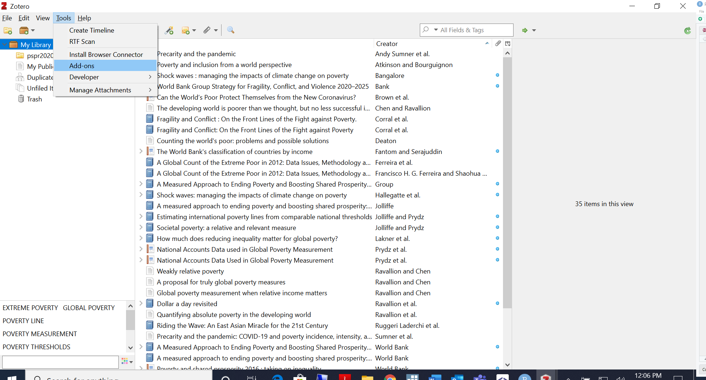

# Referencing software: Zotero

This chapter presents how to work with Zotero as a referencing software to be used in documents relevant for the Povcalnet team. The goal of using this software is to be able to collaborate on libraries that can be used in different documents by team members. Zotero is a free source referencing software with many convenient feature and that can be used within Word documents. 

## Installation

The first step is to open your browser and download Zotero [Here](https://www.zotero.org/download/). 
Once you click on download, you will double click on the Zotero.exe file and still wil start the installation. You will be asked to give admin credentials as the installation process starts. Notice that, after you have put in your credentials the pop-up window will give you a red message reading: "This software requires elevation". However, once you click on Cancel you will see that the installation can continue even without providing admin credentials, you will see this screen:

```{r zotero1, echo=FALSE, fig.align="center", fig.cap = "Click on Next"} 
knitr::include_graphics("images/zotero1.PNG") 
``` 
Click on next and follow the instructions for installation. Once the installation is complete you will be asked to Open Zotero. This is how the main screen looks like.

```{r zotero2, echo=FALSE, fig.align="center", fig.cap = "Zotero"} 
knitr::include_graphics("images/zotero2.PNG") 
``` 

#Extensions and add-ons
*Chrome Connector*

Before we proceed with how to use Zotero, we need to install additional features that can make our life easier. 
One nice feature is that Zotero can save your references directly from your browser and import them to your library. This is how you install the browser connector. 

When you visited the download page, you saw that you can add the Chrome Zotero Connetor [Here](https://www.zotero.org/download/). The Chrome Connector will automatically sense content as you browse the web and allow you to save it to Zotero with a single click. You can also download the connectors for other browsers following the link highlighted in the figure below. 
Click on install Chrome Connector

```{r addons1, echo=FALSE, fig.align="center", fig.cap = "Install Chrome connector"} 
knitr::include_graphics("images/addons1.PNG") 
``` 

You will be sent to this page, where you should click on "Add to Chrome": 

```{r addons2, echo=FALSE, fig.align="center", fig.cap = "Add Chrome extension"} 
knitr::include_graphics("images/addons2.PNG") 
``` 

Once you open a new tab/window in Chrome you will see the Zotero extension as a "Z" in the top right corner of the taskbar: 

```{r chrome1, echo=FALSE, fig.align="center", fig.cap = "Zotero extension in Chrome homepage"} 
knitr::include_graphics("images/chrome1.jpg") 
``` 

*Word Add-ons*
Another nice feature is that Zotero can be used within Word documents. This means that you can add your references and bibliography using two easy to install add-ons. Here is how to install them. 

First, you open Zotero on you computer and click on Tools-> Add-ons:
```{r wordaddon1, echo=FALSE, fig.align="center", fig.cap = "Word Add-ons"} 
 
``` 

