# (PART) Miscellaneous {-}

# Referencing software: Zotero

This chapter presents how to work with Zotero as a referencing software to be used in documents relevant for the Povcalnet team. The goal of using this software is to be able to collaborate on libraries that can be used in different documents by team members. Zotero is a free source referencing software with many convenient feature and that can be used within Word documents. 

## Installation

The first step is to open your browser and download Zotero [Here](https://www.zotero.org/download/). 
Once you click on download, you will double click on the Zotero.exe file and still wil start the installation. You will be asked to give admin credentials as the installation process starts. Notice that, after you have put in your credentials the pop-up window will give you a red message reading: "This software requires elevation". However, once you click on Cancel you will see that the installation can continue even without providing admin credentials, you will see this screen:

```{r zotero1, echo=FALSE, fig.align="center", fig.cap = "Click on Next"} 
knitr::include_graphics("images/zotero1.PNG") 
``` 
Click on next and follow the instructions for installation. Once the installation is complete you will be asked to Open Zotero. This is how the main screen looks like.

```{r zotero2, echo=FALSE, fig.align="center", fig.cap = "Zotero"} 
knitr::include_graphics("images/zotero2.PNG") 
``` 

## Extensions and add-ons
*Chrome Connector*

Before we proceed with how to use Zotero, we need to install additional features that can make our life easier. 
One nice feature is that Zotero can save your references directly from your browser and import them to your library. This is how you install the browser connector. 

When you visited the download page, you saw that you can add the Chrome Zotero Connetor [Here](https://www.zotero.org/download/). The Chrome Connector will automatically sense content as you browse the web and allow you to save it to Zotero with a single click. You can also download the connectors for other browsers following the link highlighted in the figure below. 
Click on install Chrome Connector

```{r addons1, echo=FALSE, fig.align="center", fig.cap = "Install Chrome connector"} 
knitr::include_graphics("images/addons1.PNG") 
``` 

You will be sent to this page, where you should click on "Add to Chrome": 

```{r addons2, echo=FALSE, fig.align="center", fig.cap = "Add Chrome extension"} 
knitr::include_graphics("images/addons2.PNG") 
``` 

Once you open a new tab/window in Chrome you will see the Zotero extension as a "Z" in the top right corner of the taskbar: 

```{r chrome1, echo=FALSE, fig.align="center", fig.cap = "Zotero extension in Chrome homepage"} 
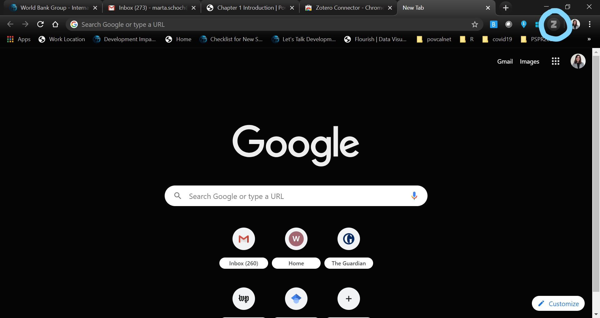 
``` 

*Word Add-ons*
Another nice feature is that Zotero can be used within Word documents. This means that you can add your references and bibliography using two easy to install add-ons. Here is how to install them. 

First, you open Zotero on you computer and click on Tools-> Add-ons:
```{r wordaddon1, echo=FALSE, fig.align="center", fig.cap = "Word Add-ons"} 
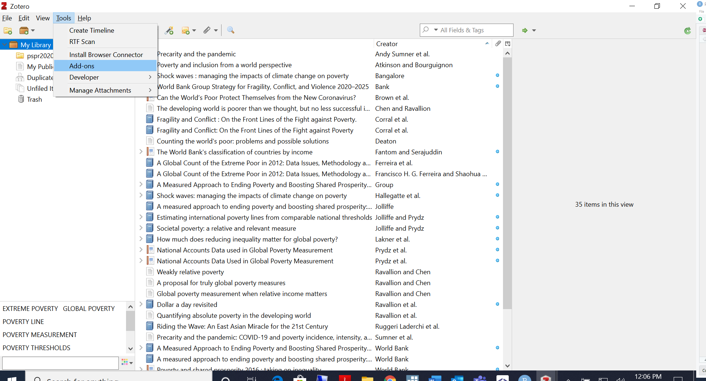 
``` 
In the "Add-ons Manager" window you will see two add-ons: Zotero LibreOffice Integration and Zotero Word for Windows. Both need to be enabled (this might require for you to contact IT to request admin credentials).
```{r wordaddon2, echo=FALSE, fig.align="center", fig.cap = "Add-ons Manager"} 
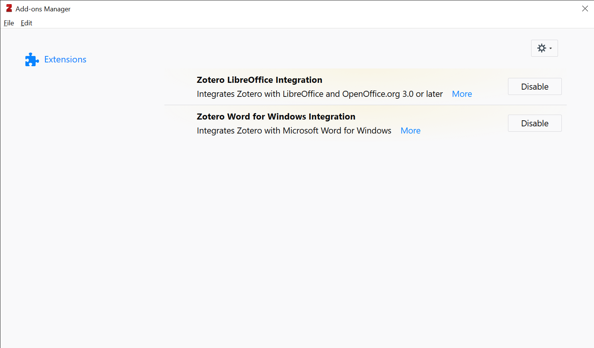 
``` 
Once the add-ons are installed you will be able to see a Zotero menu in your Word document:
```{r wordaddon3, echo=FALSE, fig.align="center", fig.cap = "Zotero menu in Word"} 
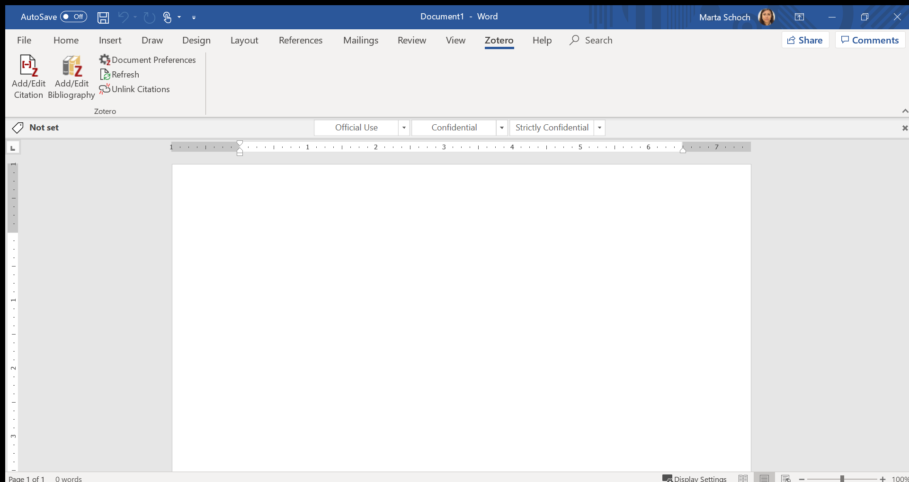 
```

## Adding references to Zotero
The next step is to see how to organize references in Zotero and add them. First let's take a look at how Zotero home screen is organized. On the top left-hand side corner you can see how your library is organized. Each Collection is a subset of the library and can be managed based on your preferences, in this case each project has a collection.
```{r zoterohome1, echo=FALSE, fig.align="center", fig.cap = "Zotero Home Page"} 
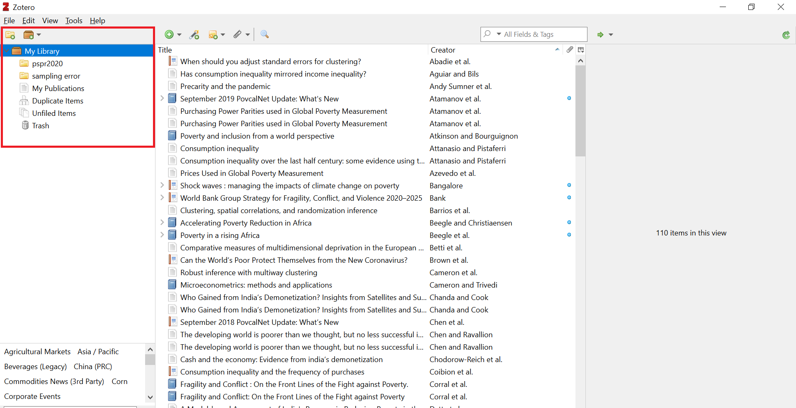 
```
You can add a new collection using the New collection icon:
```{r newcoll, echo=FALSE, fig.align="center", fig.cap = "New Collection"} 
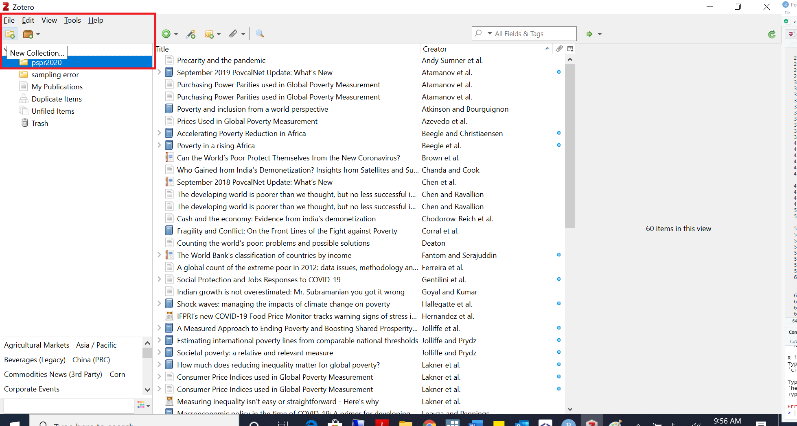 
```
The actual references that you can use in your bibliography are the list of titles in the center of the page. You can add a reference manually clicking on the green icon with a white plus and fill-in the fields manually:
```{r newitem, echo=FALSE, fig.align="center", fig.cap = "New Item"} 
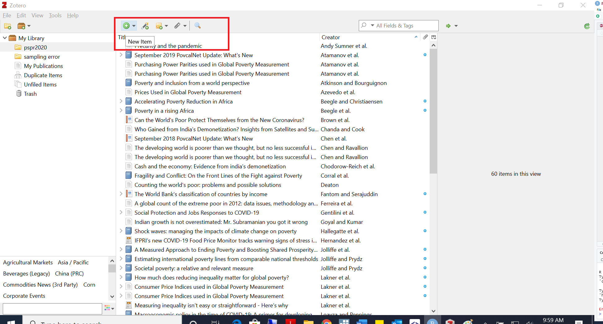 
```
```{r newitem2, echo=FALSE, fig.align="center", fig.cap = "Fill-in fields manually"} 
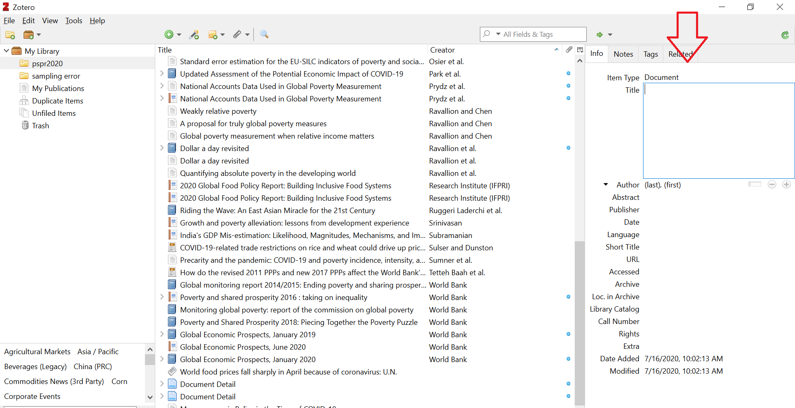 
```
Although it is useful to add references manually (e.g. blogposts, websites), the nicest feature of Zotero is its connector with Chrome (and other browsers) that allows you to add references directly from Google Scholar or other websites with referencing information. Once you look for a reference in google scholar, you can right-click on the page and select "Save to Zotero", select the document you want to add and click OK, you will see that the document has been added to your collection (right-hand side corner)
```{r scholar1, echo=FALSE, fig.align="center", fig.cap = "Add reference from Google Scholar"} 
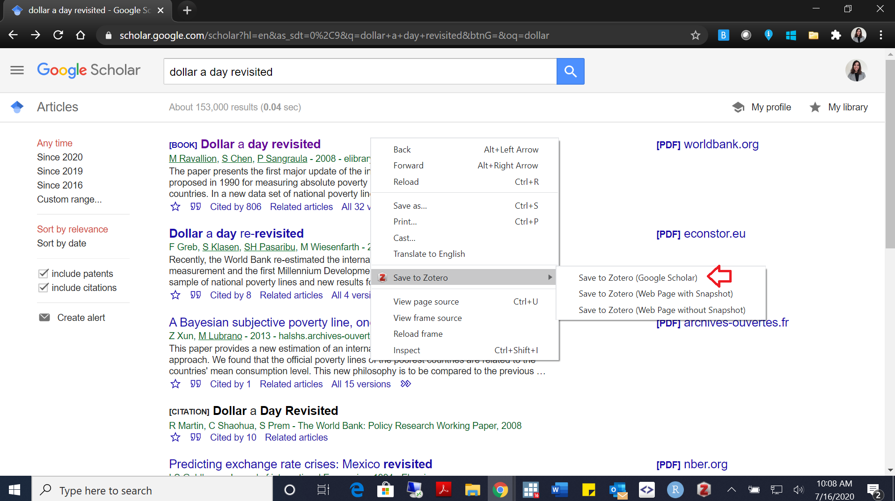 
```
```{r scholar2, echo=FALSE, fig.align="center", fig.cap = "Add reference from Google Scholar"} 
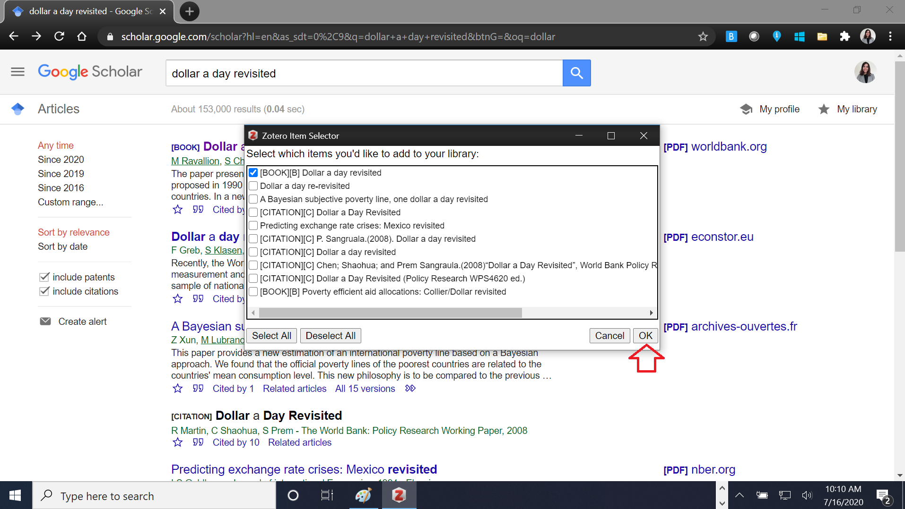 
```
```{r scholar3, echo=FALSE, fig.align="center", fig.cap = "Add reference from Google Scholar"} 
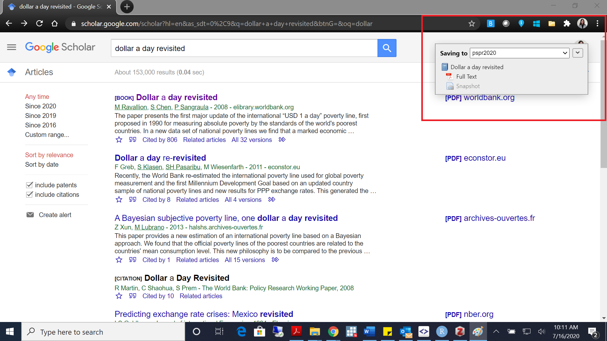 
```
You can save the references also from other pages that have embedded referencing metadata (this is not always well organized, so probably better to use scholar).

```{r other1, echo=FALSE, fig.align="center", fig.cap = "Add reference from other website"} 
 
```
```{r other2, echo=FALSE, fig.align="center", fig.cap = "Add reference from other website"} 
 
```

The final step in the basic use of Zotero is to add the saved references in your word document. This are the main steps. Open your Word document and click on add citation from the Zotero menu, and the icon "Add/Edit Citation" on the left-hand side corner:
```{r fromword, echo=FALSE, fig.align="center", fig.cap = "Add/Edit citation from Word"} 
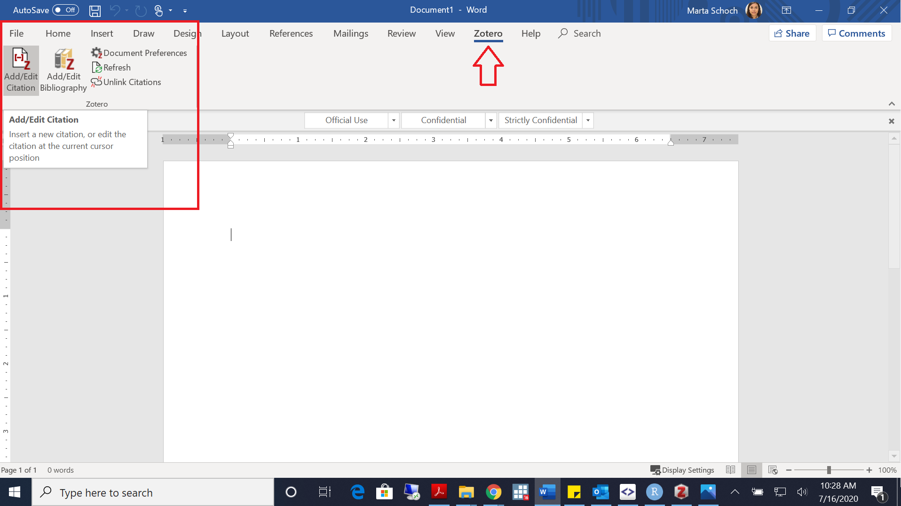 
```
You will be asked to choose the citation format:
```{r fromword1, echo=FALSE, fig.align="center", fig.cap = "Choose citation style"} 
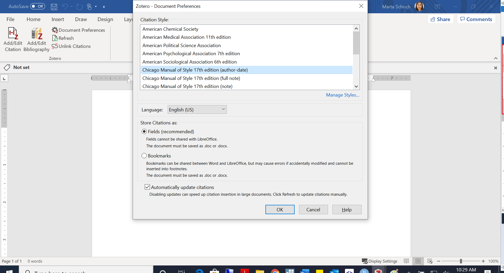 
```
You can now type the document you want to add (search by author name, title or date-all work):
```{r fromword2, echo=FALSE, fig.align="center", fig.cap = "Select citation"} 
 
```
You will see that the citation has been added to your document. The final step is to add your full bibliography. 
```{r fromword3, echo=FALSE, fig.align="center", fig.cap = "Add bibliography from Word"} 
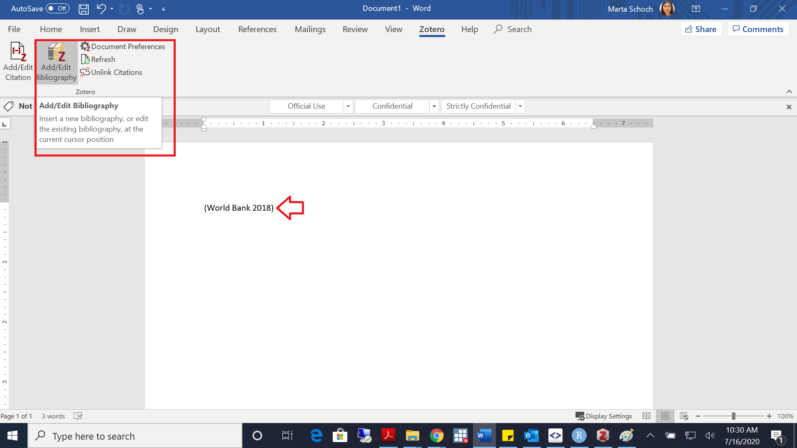 
```
This is the final result:
```{r fromword4, echo=FALSE, fig.align="center", fig.cap = "Citation and bibliography added to document"} 
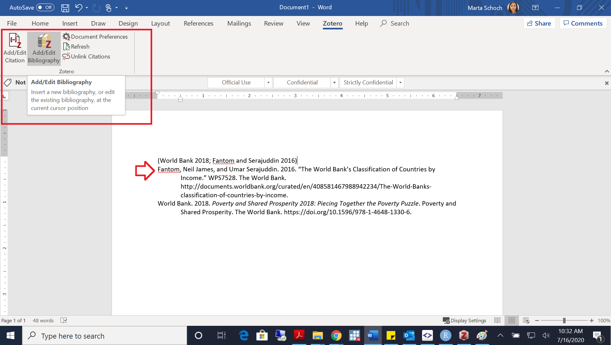 
```


