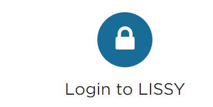

# LIS Data {#lis-data}

Some of the countries that are not available in DataLibWeb can be found
in the repository of the [LIS Cross-National Data
Center](https://www.lisdatacenter.org/) (hereafter, LIS). Currently,
PovcalNet uses LIS data for 8 high-income economies: AUS, CAN, DEU, ISR,
JPN, KOR, TWN & USA, plus the Pre-EUSILC years (generally before 2002)
of European Economies.

LIS datasets cannot be downloaded in full; however, they provide a
remote-execution system,
[LISSY,](http://www.lisdatacenter.org/data-access/lissy/) that allows us
interact with their microdata without having access to the individual
records. We have developed a set of Stata do-files to interact with
LISSY and aggregate the welfare distribution of our countries of
interest to 400 bins. Then, these data is organized locally and shared
with the Poverty GP to be included in DataLibWeb as a collection
independent from GPWG.

## The LIS_data repository

In order to work with the LIS data you need to clone the repository
[PovcalNet-Team/LIS/\_data.](https://github.com/PovcalNet-Team/LIS_data)
You will find in there three folders, *00.LIS_output*, *01.programs*,
and *02.data*.

## Interacting with LISSY

**Opening an account in LISSY:**

To interact with the LIS data you need to first register
[**here**](http://www.lisdatacenter.org/lis-luli-frontend-webapp/app/request-account-identification),
by first completing the [LIS microdata User Registration
Form](http://www.lisdatacenter.org/wp-content/uploads/our-microdata-user-registration-form.pdf),
and then submitting it through the same website using your
**institutional e-mail** account. Within a couple of days, you will
receive an e-mail from LIS containing your username and password.

::: {.bg-gray}
::: {.tl}
***Note:** You do not get to choose your own username or password. They
create both for you and those won't change in time. Make sure to save
that e-mail and record that information for your future log-ins. Also,
know that LISSY passwords expire each year on December 31st. While your
password won't change, it must be
**renewed**[here](http://www.lisdatacenter.org/lis-luli-frontend-webapp/app/request-renew-identification)
after January 1st.*
:::
:::

**Interacting with LISSY:**

To get acquainted with LISSY's interface, coding structure, database
naming and variables available, and learn how to compute estimates
within LISSY we highly recommend taking some time to review the
[**tutorials**](https://www.lisdatacenter.org/resources/) and
[**self-teaching
materials**](https://www.lisdatacenter.org/resources/self-teaching/).
However, in order to update the 400 bins twice a year, Stata codes have
been previously written, so you simply need to follow the 5 steps in the
next section.

## Getting the 400 bins from LISSY

**1.** To log in, go to [LIS main page](https://www.lisdatacenter.org/),
scroll down and click on the lock icon
{width="113"}

**2.** Feed the three drop-down menus on top of the platform with the
following information:

-   Project: **LIS**

-   Package: **Stata**

-   Subject: (*Choose a name* Ex: "**Bins \#1 - Dec 2020**")

::: {.bg-gray}
::: {.tl}
**IMPORTANT** ⚠️**:** The LISSY platform cannot run the code for ALL
surveys available at once. If you attempt to do so, your project will
stop and you will receive an e-mail containing the text:

``` {.tl}
#####################################################
  Your job has been killed and will be not executed  
#####################################################
```

To avoid this, we need to run the code in groups of 5 to 6 countries,
depending on the amount of years in each of them. Currently, LIS has
data for [52 countries]{.ul} (26 of them are in the EUSILC project, and
26 do not) which usually take approximately [10 rounds]{.ul} of this
process.
:::
:::

**3.** **Copy and paste** the entire content of `01.LIS_400bins.do` file
into the the main large command window and update the locals in lines
23-24 with the LIS 2-letter acronyms of the group of 5-6 countries in
each round.

```{stata, eval = FALSE}
local silc   "at be cz"
local nosilc "au br"
```

> ⚠️ Remember to update the subject with each round (Ex: "Bins \#2 - Dec
> 2020") so you keep track of the number of output files. Be careful not
> to leave out [or repeat] any country in the process.

**4**. Click on the green arrow
{width="18" height="15"}icon to submit
your project. You will get an e-mail within some minutes with your
output. If the system kills your project, your group of countries was
probably too large. Remove one country and try again.

**5.** Copy the entire text in the output e-mail you receive for each
round, open your notepad and paste. Save each round in the
***\\00.LIS_output*** folder. Save each text file with the name
**LISSY_Dec202\@\_\#.txt**, [where \@ is the year and \# the round].
Consistency with this naming format is important for the next step
(`02.LIS_organize_output.do` file)

## From Text file to datalibweb structure

We now need to convert the the text files generated by the LISSY system
to actual data suitable for datalibweb. This structure is suggested by
the [International Household Survey Network](https://ihsn.org/) (IHSN).
Once the data is saved in folder `00.LIS_output` you need to execute the
file **`02.LIS_organize_output.do`**. This file created to be executed
in just one go. However, it could be ran in sections taking advantage of
the different
[frames](https://www.stata.com/new-in-stata/multiple-datasets-in-memory/)
along the code.

Before you execute this code, you need to ensure a few things,

### 1. Get `rcall` working in your computer

The processing of the text files is not done anymore on Stata but in R.
To avoid changing systems, we need to execute R code directly from
Stata. In order to do this, you need to make sure to have install R in
your computer and also the Stata command `rcall`. The do-file
`02.LIS_organize_output.do` will check if you have it installed and will
install it for you in case it is not. However, you can run the lines
below to make sure everything is working fine. Also, you can take a look
at the help file of `rcall` to get familiar with it.

```{stata, eval = FALSE}
cap which rcall
if (_rc) {
	cap which github
	if (_rc) {
		net install github, from("https://haghish.github.io/github/")
	}
	github install haghish/rcall, stable
}
```

### 2. Personal Drive {.unnumbered}

Make sure to add your UPI to the appropriate sections it appears by
typing `` disp lower("`c(username)'") `` , following the example below,

```{stata, eval = FALSE}
if (lower("`c(username)'") == "wbxxxxx") {
	local dir "c:/Users/wbxxxxx/OneDrive - WBG/WorldBank/DECDG/PovcalNet Team/LIS_data"
}
```

### 3. Directives of the code {.unnumbered}

This do-file works like an ado-file in the sense that the output depends
on the value of some local macros,

```{stata, eval = FALSE}
global update_surveynames = 1 // 1 to update survey names.
global replace            = 0 // 1 to replace data in memory even if it has not changed
global p_drive_output_dir = 0 // 1 to use default Vintage_control folder
```

If local `update_surveynames` is set to 1, the code will load the sheet
`LIS_survname` from the the file `02.data/_aux/LIS datasets.xlsx` and
updated the file `02.data/_aux/LIS_survname.dta`. If `replace` is set to
1, the code will replace any output with the same name. Otherwise, it
will create a new vintage version *if the two files are different*. If
they are not different, the code will do nothing. local
`p_drive_output_dir` is deprecated, so you must leave it as **0**.

### 4. Pattern of the text files {.unnumbered}

When the text files with the information from LIS are stored in
`00.LIS_output`, they should be stored in a systematic way so that they
could be loaded and processed at the same time. This can be done by
specifying in a matching regular expression in local `pattern`. For
instance, all the files downloaded in December, 2020 could by loaded and
processed using the directive, `local pattern = "LISSY_Dec2020.*txt"`.

### 5. Output {.unnumbered}

When the do-file is concluded, it saves the file
`02.data/create_dta_status.dta` with the status of all the surveys
processed.

## Compare new LIS data to Datalibweb inventory

To identify what data is new and what data has changed with respect to
the one available in datalibweb, you need to execute do-file
`03.LIS_compare_dlw.do`. Again, this do-file is intended to be executed
in one run, but you can do it in parts taking advantage of the different
frames. At the end of the execution the file
`02.data/comparison_results.dta` is created. This file contains three
important variables `wf`, `wt`, and `gn`, which correspond to the ration
of welfare means, weight means, and Gini coefficient between the data in
datalibweb and the data in the folder,
`p:/01.PovcalNet/03.QA/06.LIS/03.Vintage_control`.

You should only send to the Poverty GP those surveys for which at least
one of these three variables is different to 1.

## The Excel file `LIS datasets.xlsx`

With each LIS data update performed, we must first identify from LIS the
new surveys (countries and/or years) they had recently added. LIS send
users e-mails informing about new datasets added, and also releases
[newsletters](https://www.lisdatacenter.org/news-and-events/highlights/)
with this information.

Inside the *02.data* folder of your LIS_data GIT repository you will
find a *\_aux* sub folder, and the `LIS datasets.xlsx` file placed in
there. We must **manually** update the tab **LIS_survname tab** adding
new rows to the sheet. All necessary information to fill up this
metadata (household size, currency, etc.) can be found in
[METIS](http://www.lisdatacenter.org/frontend#/home).

::: {.bg-gray}
::: {.tl}
**ACRONYMS:** The column survey_acronym is created by us. If you come
across a new survey for which an acronym has not been previously
established, the rules applied in the past by the team were the
following:

-   Acronyms are created based on the ENGLISH name of the survey. (Ex:
    *German Transfer Survey (Germany)* is "GTS", followed by the suffix
    -LIS; thus GTS-LIS.

-   For the surveys that were Microcensus, we created the acronym "MC",
    and for Denmark's Law Model, "LM".

-   All acronyms are created in capital letters.
:::
:::

Finally, while the survey names in METIS are in English, some of the
acronyms in parenthesis are still in the original language. In those
cases we translated them to English. For instance, the survey name
"*Household Budget Survey (BdF) (France)*" from METIS was changed to
"*Household Budget Survey (**HBS**) (France)*" in the column
**surveyname** of the excel.

## Prepare data for the Poverty GP

Finally, the do-file `04.Append_new_LIS_bases.do` prepares the data to
be shared with the Poverty GP. Note that this do-file ONLY appends the
400 bins data of surveys that are **new** and those where **welfare
changed**, which are identified in the previous step
`/comparison_results.dta` as those `gn != 1`.

Before running the code, make sure to **change the output file name** to
the **date** of your update (last one saved was
"LIS_bins_Dec_21_2020.dta"). The output is saved in
`P:\01.PovcalNet\03.QA\06.LIS\04.Share_with_GP.`

Finally, quickly prepare a short .dta file importing the metadata
already created in the LIS_survname tab from the Excel, keeping ONLY the
surveys of the append output you just run and send both files to Minh
Cong Nguyen \<mnguyen3\@worldbank.org\> from the Poverty GP.
