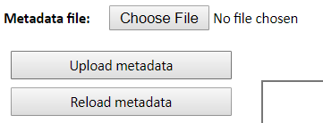

# Update the Master file {#master-file}

In the previous chapters we have seen how to update different sheets of the
master file. In this chapter we basically summarize and reference to the
specific location in which we explain how to update each spreadsheet.

## Upload Master file

Once the master file has been updated using the *Master file tool*, you may
proceed to upload the latest version of the master file by selecting the most
recent file in the folder p:/01.PovcalNet/00.Master/02.vintage. Then, click on
`Choose file` next to the **Metadata file** legend. Once the file has chosen,
you may click on `Upload metadata` and then on `Reload metadata`.

```{r DM-metadata, echo=FALSE, fig.cap = "Upload files", fig.show = "hold", out.width = "50%", fig.align = "center"}

```
