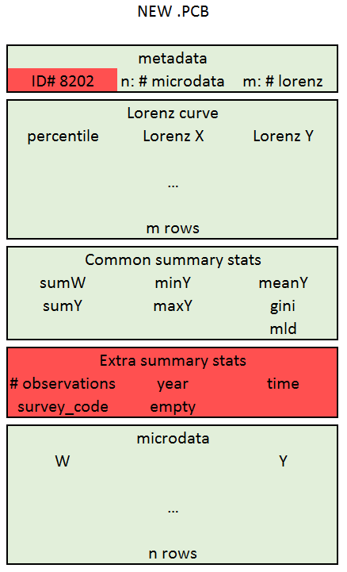

# Create .PCB files {#create-pcb-files}

```{r, include = FALSE}
library(flair)
```

As explained in the [introduction](#intro-povcal) of this part of the book,
creating the .PCB files is the last step of the process before uploading
everything to the PovcalNet system.

## What the heck is a PCB file?!!

PCB files are only relevant for micro-data. They basically store the micro-data
`welfare` and `weight` vectors, as well as pre-computed statistics. They are
custom binary files (data is stored as a bunch of 0s and 1s) that were created
to support the computations in PovcalNet. It is not a standard file format like
`.csv` or `.dta`.

They are used because they:

-   Take less space
-   Can be read more efficiently

PCB files contain four pieces of information:

-   Metadata

    -   The PCB ID number. There are actually two types of .PCB files, an old
        and a new format. The ID number is a way to differentiate them.
    -   The number of microdata records
    -   The number of points on the Lorenz curve

-   Lorenz Curve

-   Pre-computed statistics\
    Statistics that need to be computed only once (i.e. not on-the-fly, since they are not sensitive to the poverty
    line)

-   Microdata



## The povcalnet\_update repository

Once you have updated all the sheets in the master file--besides the
"SurveyMean" sheet--and have updated the microdata in the P drive, the next step
is to create the .pcb files and update the "SurveyMean" sheet. All of this is
done with the
[PovcalNet-Team/povcalnet\_update](https://github.com/PovcalNet-Team/povcalnet_update)
repository. Make sure you clone the repo and open it as a [project in
Rstudio](https://martinctc.github.io/blog/rstudio-projects-and-working-directories-a-beginner's-guide/).
You will find the project has three .R files only. If everything goes as
expected, you'll only need to use the file *00.master.R*.

In rare cases, you will need to modify the functions in the other two files. The
*utils.R* file has generic functions such as loading the master file into the
system, or creating survey IDs. These functions are used all along the process.
The *process\_functions.R* file contains functions for specific parts of the
projects which are executed usually once along the whole process. Basically, the
*00.master.R* calls these functions in order in the same way that a master
do-file calls other do-files that do specific things.

In this chapter, we break down the *00.master.R* file, so you understand how to
run it, the logic behind, and what to do in case it needs to be fixed. Let's
start by installing the minimum necessary packages. The *00.master.R* file assumes
you already have them installed, so you should run the code below before you
start.

```{r, eval = FALSE}
# pkg_load <- knitr::combine_words(pkgs, before = "`")
pkgs <- c("janitor", "data.table", "tidyverse", "writexl", "readxl", "here", "devtools")
no_installed <- pkgs[!(pkgs  %in%  installed.packages())]
installed.packages(no_installed)
```

## Generate the .pcb files

### Directories

The first section includes the directories in which you're going to be working.
As of today (2020-11-20), the `datadir` directory is for `2020_JUL` as it was
the last release of PovcalNet. However, make sure you create a new folder with
the year and month of the "tentative" release.

```{r pdirs, eval = FALSE}
datadir   <- "p:/01.PovcalNet/02.Production/2020_JUL/"
cpi_path  <- "p:/01.PovcalNet/01.Vintage_control/_aux/price_framework/price_framework.dta"
sheet     <- "SurveyMean"
mdir      <- "p:/01.PovcalNet/00.Master/"
```

### Surveys that have changed {#init-params}

Now, we have to specify what countries/years have been added or changed to the
PovcalNet repository. We recommend you do this country by country.

```{r}
#--------- to modify in each round ---------
countries <- "CHN"
years     <- NULL
```

If you leave the argument `years` equal to `NULL`, the code will update all the
years for the country select. In this case, `r countries`. However, you could
specify what years to update for that particular country, like,

```{r}
countries <- "IND"
years     <- c(1993, 2004, 2009, 2012)
```

It is important to note that *unless you want to update all the years available*
in more than one country, you should not include in the `countries` variable
more than one country.

### Prepare metadata

In the next part we prepare the data. Function `pcn_datafind` finds the
directory path and filenames of the corresponding countries in variable
`countries`. It returns a list with two objects, `fail` and `pcn`. Object `fail`
lets you know if there is any particular data that could not be loaded. Object
`pcn` contains a data frame with the information above.

```{r, eval=FALSE}
# Find countries
tmp       <- pcn_datafind(country = countries)
pcn_fails <- tmp$fail
pcn       <- as.data.table(tmp$pcn)

# Fix metadata
pcn       <- fix_metadata(pcn)

# Get reference year
pcn       <- get_ref_year(pcn, cpi_path)
```

Then `pcn` object is then passed to the `fix_metadata` function in which some
columns like welfare type and survey coverage are added. Finally, function
`get_ref_year` merges the price framework data from `datalibweb` to assign the
right reference year to each survey. Keep in mind that `get_ref_year` makes some
*hard-coded* adjustments. Check those in case the resulting reference year is
incorrect.

### Generate .pcb files

Now that the metadata is ready, we can create the .pcb file. This is done with
this code,

```{r, eval = FALSE}
# -------------------- Create PCB --------------------
replace_file <- TRUE
pcb_status <- generate_pcb_files(df           = pcn, 
                                 countries    = countries,
                                 years        = years, 
                                 replace_file = replace_file,
                                 datadir      = datadir
```

The function `generate_pcb_files` takes the directory paths of the microdata in
the `pcn` object, loads the microdata, and, inside the `datadir` directory,
creates the .pcb file into the `/01.pcb/` subdirectory and and .rds file (R
readable) into the `/02.rds/` sub-directory. The creation of the .rds is for
convenience. It allows you to check the data in the .pcb in an easy way. The
.pcb file, in contrast, is harder to read directly in R. Except for the file format, two files are identical. 

One feature of the `generate_pcb_files` function is that you can add additional
filters by country and year. By default, only the `years` objects defined [above](#init-params) is
being used until this point. In fact, you could create another object, say `countries2`, and
parse it into the argument `countries` of the `generate_pcb_files` function.

Up to this point, the generation of the .pcb files is concluded, but the
PovcalNet system requires two types of inputs, welfare data and the master file.
We still need to update the "SurveyMean" sheet of the Master file.

## Update the Master file {#master-objectives}

Updating the Master file is the most challenging part of the whole process
because we need to make sure that,

1.  whatever is correct **must remain** correct.
2.  whatever is wrong should be fixed
3.  whatever is not necessary should be removed
4.  whatever is missing should be added
5.  whatever is duplicated **must be** unified.

Thus, we recommend that you run this sections one by one and check the results
in between. This is specially important for countries with urban/rural coverage
like China, India, or Indonesia; for countries with lagging reference years like
EU-SILC countries, or for tricky countries like ... (Macedonia?).

### Updatint the "SurveyMean" sheet

The first step is to extract some important metadata information from the .rds
files generated in the previous step. This is done with the following code,

```{r, eval = FALSE}
lf <- update_master_info(df        = pcn, 
                         countries = countries,
                         years     = years)
st  <- lf$s
df <- lf$df

table(st$status)
filter(st, status != "OK")
```

The object `lf` is a list with two objects, `st` and `df`. Object `st` is merely
the status of each survey in the `update_master_info` process, whereas `df` is
the actual metadata of the *new data*. Now, the following code loads the data in
the most recent version of the Master file,

```{r, eval = FALSE}
lmf     <- load_masterfile()
mf      <- lmf$data$SurveyMean
reg_ctry <- lmf$data$CountryList %>% 
  select(
    Region      = WBRegionCode, 
    CountryCode = CountryCode, 
    countryName = CountryName
  )
```

The function `load_masterfile` returns a list that is then bound to the name
`lmf` (this function takes a while to run especially if you're working
remotely). The main object of `lmf` is another list, `data`, that contains a
data frame per sheet. So, in the code above, you're creating object `mf` with
the "SurveyMean" and `red_ctry`, with the "CountryList" sheet. The reason why we
load the whole master file is that, when we create a new version we want that
version to include all the sheets, even those that were not modified. Function
`writexl::write_xls`, which is the function that saves the new version of the
master file, uses a list with all the sheets to save the file.

Now, we need to organize the new information into the "SurveyMean"
format. This is done with function `survey_mean_info`. However, and this one of
the tricky parts, we need to make sure that the [five objectives
above](#master-objectives) are met when we include the information of the new
data. The `survey_mean_info` function handles all the generic cases, but there
are some cases that need to be removed manually. This is why we have the object
`condition` that goes directly as one of the arguments of `survey_mean_info`. If it is necessary to manage any special cases, this object should be set to an empty
string, `condition <- ""`. Let's see some examples of real cases in which we had
to use the object `condition`.

```{r, eval = FALSE}
condition <- '!(countrycode == "IND" & year == 2012)'
```

In this case, we needed to remove the observation for India 2012, because even
though the `CPI_Time` variable in the master file is 2012, the `SurveyTime`
variable is 2011.5.

```{r, eval = FALSE}
condition <- '!(countrycode == "CHN" & grepl("A$", module))'
```

Here we needed to remove all the observations of China for which the module
finished in a letter A.

```{r, eval = FALSE}
condition <- '!(countrycode == "CHN" & year >= 1990 & welfaretype3 == "y")'
```

Here, there was a problem in the metadata and we needed to remove all the
observations for China after 1990 for which the welfare type was coded as
income, when in reality it was consumption.

```{r, eval = FALSE}
condition <- paste0('!(countrycode  %in% ', 
                    deparse(countries),
                    ' & year  %in%  ', 
                    deparse(years),')'
                    )
```

This final example is a general form in which we remove old observations for all
the countries and years for which there is new data. This is very useful if we
want to start a country from scratch.

Now, we just need to identify the data that remains unchanged in the "SurveyMean" sheet using the
function `unchanged_data()` and then append together the new data, `dfn,` and
the `unchanged` data. Finally, we update the Master file using the function
`update_master_file`, which receives four arguments, `lmf`, the current version
of the master file with all its sheets; `vintage`, the vintage control sheet
which is loaded separately and it is useful only for institutional-memory
purposes; `new_mf`, which is the new "SurveyMean" sheet with unchanged and new
data; and `mdir`, which is the directory of the master file.

You should be fine if you execute all these steps one by one, while checking the
intermediate outputs.
